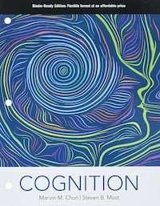

# Basic Issues in Cognition (Spring 2024)
UC Berkeley [Cogsci 100](https://classes.berkeley.edu/content/2024-spring-cogsci-c100-001-lec-001)  // [Psych C120](https://classes.berkeley.edu/content/2024-spring-psych-c120-001-lec-001)

](dall-e-berkeley-cognition.png "")

**Welcome!** I hope you enjoy *Basic Issues in Cognition*. Try to do the readings (see schedule below) before class. 

## Course Description
This course provides a survey of central topics in the science of cognition. We will discuss basic capabilities of human cognition (e.g. perception, attention, memory, imagery), some processes made possible by these capabilities (e.g. categorization, judgement and decision-making), and some higher cognitive functions that combine these processes (e.g. reasoning, social cognition, and language). We will study psychological concepts in light of two guiding perspectives: computational theories of cognition, and cognitive diversity.  

## Course Information
-   Meeting Times: Tuesdays and Thursdays, 5pm - 6:30pm, Evans Hall Room 10
-   Course Google Calendar: [join here](https://calendar.google.com/calendar/u/0cid=Y18wYzY1MTNiYjU3YWEwODg0OGExZjRhMzU3ZDFjOGI3ZTFiNjJhNTRiNTA4YjU3NTUxYjVjMTc5ODMxZWRhZjg1QGdyb3VwLmNhbGVuZGFyLmdvb2dsZS5jb20)
-   Instructor: Prof. William Thompson (wdt@berkeley.edu)
-   Office hours: Friday 2:00pm - 3:30pm, 3rd Floor, Berkeley Way West (or Google Meet). **Sign up** for a slot here:
    [https://calendar.app.google/MnDoBCQzr486JVau9](https://calendar.app.google/UnFdS3GrfKzB1nN79)
-   Course Assistant: Annya Dahmani (adahmani@berkeley.edu)
-   Course page in catalogue: [https://classes.berkeley.edu/content/2024-spring-cogsci-c100-001-lec-001](https://classes.berkeley.edu/content/2024-spring-cogsci-c100-001-lec-001)
-   Exams: **two midterms** (in-class, multiple-choice, 30% of grade), **one final** exam (20% of grade)
-   Assignments: **five short reflection excersises** (20% of grade, complete/incomplete) + **2 Hours Psych RPP** (5% of grade, complete/incomplete) + **Course Paper** (25% of grade)

## Important Dates
See also the [course google calendar](https://calendar.google.com/calendar/u/0cid=Y18wYzY1MTNiYjU3YWEwODg0OGExZjRhMzU3ZDFjOGI3ZTFiNjJhNTRiNTA4YjU3NTUxYjVjMTc5ODMxZWRhZjg1QGdyb3VwLmNhbGVuZGFyLmdvb2dsZS5jb20)

-   Assignment 1 due: 01/21/24
-   Midterm 1 (in class): Tuesday 02/06/24
-   Assignment 2 due: 02/09/24
-   Midterm 2 (in class): Tuesday 03/05/24
-   Assignment 3 due: Friday 03/22/24
-   Assignment 4 due: 04/19/24
-   Course paper due: 04/28/24
-   Assignment 4 due: 04/25/24
-   Final Exam (in person): Tuesday May 7th

## Textbook
**Cognition** by Steven Most and Marvin Chun, Oxford University Press 2021, 1st Edition ISBN: 9780199950638. This textbook will be the primary required reading throughout the course. Additional readings will be posted in bCourses. 

-   Digital copies at the library:
    [https://ucbears.lib.berkeley.edu/991085972128806532_C115932639/view](https://ucbears.lib.berkeley.edu/991085972128806532_C115932639/view)
-   At the student store:
    [https://calstudentstore.berkeley.edu/textbooks?section-ids=390763](https://calstudentstore.berkeley.edu/textbooks?section-ids=390763)

## Course Schedule

The schedule of topics and readings below is prelimenary. The exam dates are fixed. 

| **Date**      | **Topic**                          | **Readings**                                                      |
|---------------|------------------------------------|-------------------------------------------------------------------|
| Tue 01/16/24  | Housekeeping                       | No Readings                                                       |
| Thu 01/18/24  | Introduction to the Science of Cognition | Required: Chun & Most Chapter 1                        |
| Tue 01/23/24  | Perception 1: Sensation and Perception | Required: Chun & Most Chapter 3 (3.1)                    |
| Thu 01/25/24  | Perception 2: Visual Perception    | Required: Chun & Most Chapter 3 (3.2)                            |
| Tue 01/30/24  | Mental Imagery 1: Visual Imagery & Aphantasia | Required: Chun & Most Chapter 3 (3.3); Optional: Zeman, A.Z., Dewar, M.T., & Della Sala, S. (2015). Lives without imagery--congenital aphantasia. *Cortex*, 73, 378-380. [Link](https://doi.org/10.1016/j.cortex.2015.05.019) |
| Thu 02/01/24  | Mental Imagery 2: Inner Speech     | Required: Fernyhough, C., & Borghi, A.M. (2023). Inner speech as language process and cognitive tool. *Trends in cognitive sciences*. [Link](https://doi.org/10.1016/j.tics.2023.08.014) |
| Tue 02/06/24  | **Midterm 1**                      |                                                                   |
| Thu 02/08/24  | No Lecture (Extended Office Hours) |                                                                   |
| Tue 02/13/24  | Attention 1                        | Required: Chun & Most Chapter 4 (4.1 -- 4.3)                      |
| Thu 02/15/24  | Attention 2                        | Required: Chun & Most Chapter 4 (4.4 -- 4.6)                      |
| Tue 02/20/24  | Memory 1                           | Required: Chun & Most Chapter 5 (just section 5.2)                |
| Thu 02/22/24  | Memory 2                           | Required: Chun & Most Chapter 7; Optional: *The truth of fact, the truth of feeling* by Ted Chaing |
| Tue 02/27/24  | Memory 3                           | Readings TBD                                                      |
| Thu 02/29/24  | Review Lecture: Attention & Memory |                                                                   |
| Tue 03/05/24  | **Midterm 2**                      |                                                                   |
| Thu 03/07/24  | No Lecture (Extended Office Hours) |                                                                   |
| Tue 03/12/24  | Similarity                         | Readings TBD                                                      |
| Thu 03/14/24  | Categorization                     | Readings TBD                                                      |
| Tue 03/19/24  | Judgement & Decision-making        | Required: Chun and Most Chapter 9 [section 9.1 and 9.2]           |
| Thu 03/21/24  | Sequential Decision-making         | Readings TBD                                                      |
| Tue 03/26/24  | No Lecture: Spring Recess          |                                                                   |
| Thu 03/28/24  | No Lecture: Spring Recess          |                                                                   |
| Tue 04/02/24  | Reasoning and Problem Solving 1    | Required: Chun and Most Chapter 10 [Section 10.1 - 10.3]          |
| Thu 04/04/24  | Reasoning and Problem Solving 2    | Required: Chun and Most Chapter 10 [Section 10.4 onwards]         |
| Tue 04/09/24  | Social Cognition 1: Theory of Mind | Required: Chun and Most Chapter 12 [Section 12.1] + Paper TBD     |
| Thu 04/11/24  | Social Cognition 2: Social Learning| Readings TBD                                                      |
| Tue 04/16/24  | Language                           | Readings TBD                                                      |
| Thu 04/18/24  | Cultural Evolution                 | Readings TBD                                                      |
| Tue 04/23/24  | Review Lecture                     |                                                                   |
| Thu 04/25/24  | TBD         |                                                                   |

## Requirements and Grading

### Midterms (30% of final grade)
- Two midterms (02/26, 03/05) 
- 15% of final grade each
- Administered in-class digitally
- Primarily multiple-choice, possibly a few short answer questions

### Final Exam (20% of final grade)
Primarily multiple-choice, possibly a few short answer questions. Will consist of two parts: a non-cumulative portion covering the material in the final third of the course (you can think of this as a 3rdth midterm) and a cumulative portion that will cover themes from the entire semester.

### Course paper (25% of final grade)
You will write a short paper in which you choose a topic from the course material, review existing relevant research, and propose a novel experiment to address a research question of your choosing. More details to follow.

### Assignments (20% of Final Grade)

Each of the five assignments is worth `4%` of your grade and graded `complete/incomplete`. 

**Assignment 1: Providing Context** You will complete a short google form asking questions about your studies at cal so far, your previous experiences or classes in cognition or adjacent topics, your interests and goals for this course and your degree, and any other relevant information that you would like to share. The purpose of this assignment is to provide a mechanism for you to share anything you would like me to know, and to help me adapt the class to evolving student needs. **Due: 01/21/24** 

**Assignment 2: Imagery Piece** You will write a short piece (or record a video if you prefer this format) describing your experiences of mental imagery (e.g. visual imagery and inner speech) using the concepts and research findings covered in the class. The purpose of this assignment is to provide an ooprunity to relate the concepts of the class to your lived experience, and to scaffold review of one of the primary topics (mental imagery) on the first midterm exam. **Due: 02/09/24** 

**Assignment 3: Mid-semester Reflection piece**
You will be asked to write short answers to a few simple questions about your experiences in the course so far, areas you have found interesting, areas you have found difficult, suggestions for course improvement, etc. The purpose of this assignment is to help us develop the course in ways that support your learning and to help you identify learning goals and strategies to focus on. **Due: 03/22**

**Assignment 4: Course Paper Proposal**
You will submit a short proposal for your course paper. The purpose of this assignment is to ensure that everyone is thinking about thier course paper before it is due. **Due: 04/19**

**Assignment 5: Course evaluation
Complete a short evaluation of the course. **Due: 04/25**

### RPP Participation (5% of final grade)
Two hours of participation in the psychology department’s research participation pool (RPP) are required (2 RPP credits) and worth 5% of your course grade. If you do not want to participate in RPP, speak to the instructor during the first two weeks of the semester for an alternative assignment. 

- Please read [RPP Information for Students](https://bcourses.berkeley.edu/courses/1531191/files/87716779?wrap=1 "RPP Information for Students_Fa22.pdf"). 
- You will need to set up a Sona account as instructed in [RPP Information for Students](https://bcourses.berkeley.edu/courses/1531191/files/87716779?wrap=1 "RPP Information for Students_Fa22.pdf"). 
- Do this as soon as possible. If you have any questions, you can contact RPP at rpp@berkeley.edu. 
- Please also make sure to **note the deadlines** listed on the RPP webpage: [http://psychology.berkeley.edu/students/undergraduate-program/research-participation-program](http://psychology.berkeley.edu/students/undergraduate-program/research-participation-program)

## Course Policies

### Late assignments
Please make every effort to submit your assignments on or before the due date. You will be allowed one late assignment without penalty (no more than 3 days after the due date). A day is defined as 24 hours following the time and date of the deadline. Submissions received more than 3 days late will receive a zero and not be graded. Late submissions after the first late submission will receive a zero and not be graded. Exceptions to this policy will be considered only under exceptional circumstances, such as a medical emergency, and will require documentation.    

### Late paper
The final paper is worth 25% of your final grade. You should be working towards the paper throughout the course, and well prepared to submit by or before the due date. The late penalty is 10% of the paper grade per day (2.5% of your total course grade), where a day is defined as 24 hours following the time and date of the deadline. Submissions received more than 3 days late will receive a zero and not be graded. Exceptions to this policy will only be considered under exceptional circumstances, such as a medical emergency, and will require documentation.  

### Missed exams. 
Alternative accommodation for missed exams will be made only under exceptional circumstances, such as a medical emergency, and will require documentation.

## Some strategies for success in this course
Attend the lectures (the exams will mirror the lectures)
Read (at least some of) the optional readings (they will be short, and carefully curated)
Choose a topic to focus extra interest on (this will help with your course paper; and learning more about one topic can improve your understanding of multiple topics)

## Students with Disabilities
If you require course accommodations due to a physical, emotional, or learning disability, contact UC Berkeley's Disabled Students' Program (DSP). Notify the instructor of the accommodations you would like to use. You must have a Letter of Accommodation on file with UC Berkeley to have accommodations made in the course. UC Berkeley is committed to providing robust educational experiences for all learners. With this goal in mind, we have activated the ALLY tool for this course. You will now be able to download reading materials in a format that best fits your learning preference (i.e., PDF, HTML, EPUB, and MP3). For more information, visit the alternative formats link or watch the video entitled, "Ally in bCourses.”

## Course Help
You’re not alone in this course; the instructor is here to support you as you learn the material. It's expected that some aspects of this course will take time to grasp, and the best way to grasp challenging material is to ask questions. To ask a question, start by using the bCourses Q&A forum. The instructor and course assistant will monitor the discussion forum. You should also feel free to help answer questions posted by other students.

## Diverse Learning Communities
Consistent with UC Berkeley’s Principles of Community, we are all responsible for creating an inclusive learning environment where diverse perspectives—expressed through race and ethnicity, culture, gender identities and sexual orientations, political and social views, religious and spiritual beliefs, learning and physical abilities, language and geographic characteristics, age, veteran status, and social or economic classes—are recognized, respected, and seen as a source of strength. We welcome your unique perspective as an individual. In the same manner, we expect you to treat every other individual in this course with respect and dignity. We encourage your suggestions on how to incorporate diversity in this course in a meaningful way.

## Student Wellness
Do your best to maintain a healthy lifestyle this semester by eating well, exercising, getting enough sleep, and taking time to recharge your mental health. Taking time to care for yourself, and avoiding academic burnout, will help you achieve your academic, professional, and personal goals.

Support Resources include emotional, physical, safety, social, and other basic wellbeing resources for students. Academic resources can be found at the Student Learning Center and English Language Resource sites. Berkeley’s Office of Emergency Management has resources to prepare for emergencies.

## Statement on Academic Integrity
You’re a member of an academic community at one of the world’s leading research universities. Berkeley creates knowledge that has a lasting impact in the world of ideas and on the lives of others; such knowledge can come from an undergraduate paper as well as the lab of an internationally known professor. One of the most important values of an academic community is the balance between the free flow of ideas and the respect for the intellectual property of others. Scholars and students always use proper citations in papers; professors may not circulate or publish student papers without the writer's permission; and students may not circulate or post materials (handouts, exams, syllabi—any class materials) from their classes without the written permission of the instructor.

Any test, paper or report submitted by you and that bears your name is presumed to be your own original work that has not previously been submitted for credit in another course unless you obtain prior written approval to do so from your instructor. In all of your assignments, including your homework or drafts of papers, you may use words or ideas written by other individuals in publications, websites, or other sources, but only with proper attribution. If you’re unclear about the expectations for completing an assignment or taking a test or examination, be sure to seek clarification from your instructor or course assistant beforehand. For additional information on plagiarism and how to avoid it, read the UC Berkeley Library Citation Page, Plagiarism Section.

As a member of the campus community, you’re expected to demonstrate integrity in all of your academic endeavors and will be evaluated on your own merits. The consequences of cheating and academic dishonesty—including a formal discipline file, possible loss of future internship, scholarship, or employment opportunities, and denial of admission to graduate school—are simply not worth it. Read more about Berkeley's Honor Code.

## Statement on Collaboration
Reviewing lecture and reading materials and studying for exams can be enjoyable and enriching things to do together with one’s fellow students. We recommend this. However, assignments should be completed independently and materials turned in should be the result of one’s own independent work.

## Psychology Major Program Learning Goals 
This course aims to address facets of each of the seven program learning goals of the Psychology Major, with particular emphasis on Program Learning Goals 1-4 and 7.

* Understand basic concepts that characterize psychology as a field of scientific inquiry, and appreciate the various subfields that form the discipline as well as things that differentiate it from other related disciplines (lectures, readings, and class discussions)

* Develop an understanding of the central questions/issues in contemporary psychology as well as a historical perspective of psychological theories and key empirical data (lectures, readings, class discussions, and papers)

* Develop a thorough understanding of one of the major content areas of psychology (i.e., Social/Personality, Developmental, Clinical, Cognitive, Biological) (lectures, readings, class discussions, and exams)

* Develop skills to critically evaluate the presentation of scientific ideas and research in original scientific papers as well as in the popular media (readings, class discussions, and papers)

* Become familiar with research methods used in psychological research, and become proficient in basic concepts of statistical analyses and familiar with more advanced methods in data analyses and modeling (lectures and RPP participation)

* Learn to develop, articulate, and communicate, both orally and in written form, a testable hypothesis, or an argument drawing from an existing body of literature (class discussions and papers)

* Apply a psychological principle to an everyday problem, or take an everyday problem and identify the relevant psychological mechanisms/issues (lectures, class discussions, and papers)
